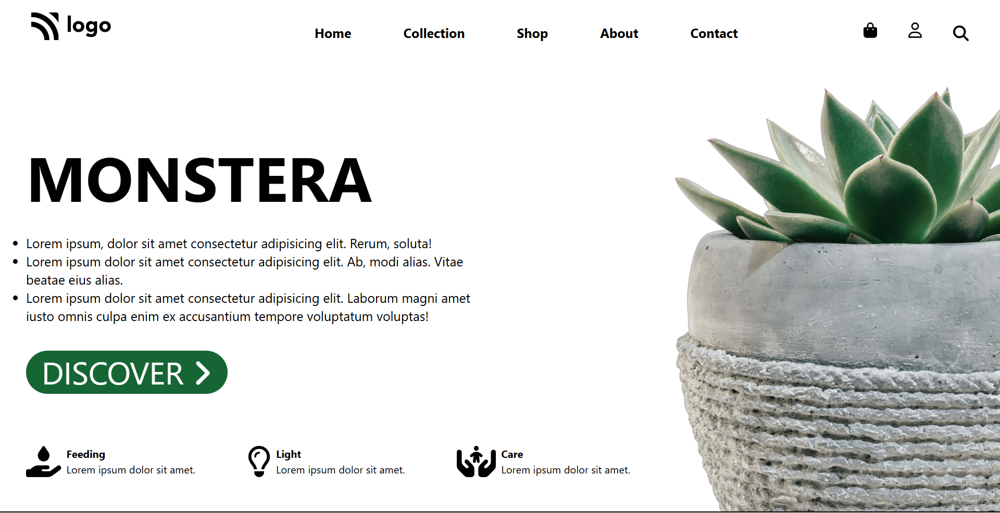
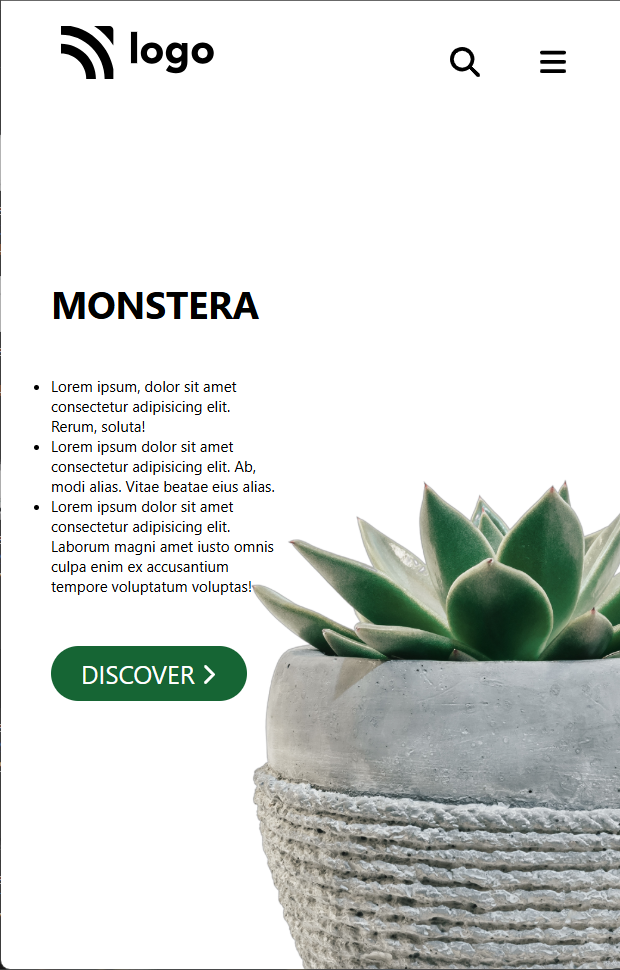

# **Sample Responsive Website Creation Using HTML and Tailwind CSS**

## Creating a responsive website with HTML and Tailwind CSS is straightforward and efficient. Tailwind CSS, a utility-first CSS framework, simplifies styling by providing pre-defined classes for layout, spacing, typography, and responsiveness.

1. **Setup**: Start with a basic HTML structure and include the Tailwind CSS CDN in your `<head>` section.

2. **Header**: Design a responsive navigation bar using Tailwind's flexbox and spacing utilities.

3. **Nav Bar Section**: Create a visually appealing hero section with responsive text and buttons.

4. **Hero Section**: Use Tailwind's grid utilities to create a responsive card section.

5. **Footer**: Add a responsive footer with links.

6. **Responsive Design**: Tailwind's responsive utilities (e.g., `sm:`, `md:`, `lg:`) make it easy to adjust styles for different screen sizes.

   By combining HTML with Tailwind CSS classes, you can quickly create a clean, responsive website without writing custom CSS.

## full screen(lg-large screen)

## half screen(md-medium screen)

## small screen(sm-small screen)

## extra small screen(xs-extra small screen)

